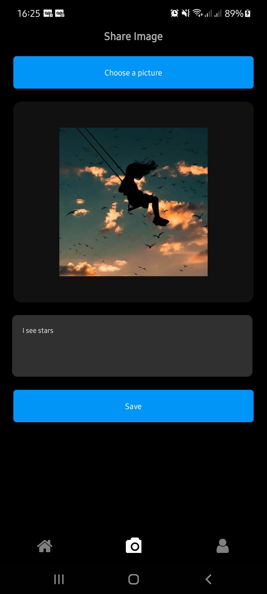
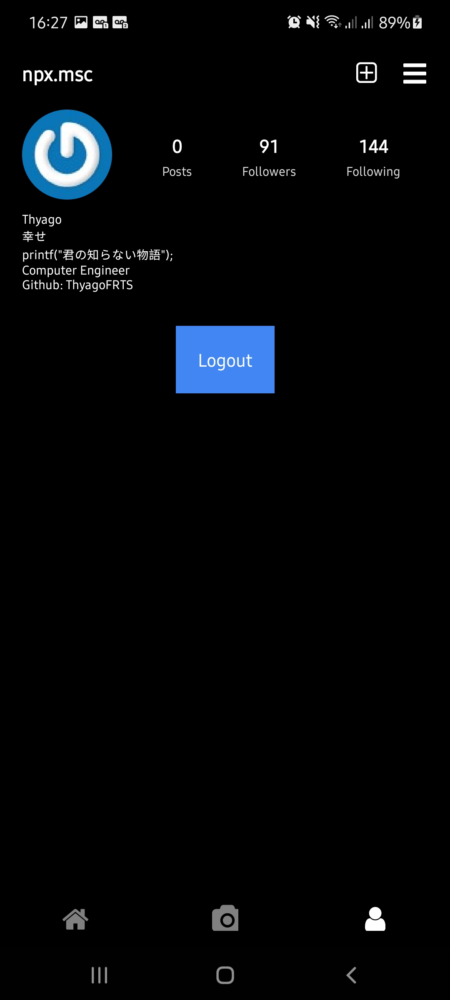

# Instagram Clone

<div align="center">
  
  
  
</div>

<p align="center">I'm trying to clone Instagram to learn a build social network apps flow</p>
<p align="center">This app dont contains all functionalities that original app, I simplified some characteristics</p>
<p align="center">
    <a href = ""></a>
</p>

## Funcionalitties

- Posts Scroll with static data
- Comment on Posts
- Login and Logout

## Technologies

- React Native
- Typescript
- Redux-toolkit
- Vector Icons

## Patterns

- Ducks Pattern

## Instalation

### Assets

Maybe you need add some configurantions in android/app/build.gradle like add this line:
```
apply from: "../../node_modules/react-native-vector-icons/fonts.gradle"
```
After this, you need to link assets to android and ios plataforms, you can do this running this command:
```
npx react-native-asset
```
If your react native version is lower than 0.69, use link command
```
npx react-native link react-native-vector-icons
```

### Firebase

You will need to create a firebase project with two databases: Firebase Realtime and Firebase Storage
When you to create, you wil get one firebase json config that you wil paste in firebase.ts file (you will need to create them). See the firebase.ts file to get a example

## Credits

All images are illustrative and I used them for static app content only
