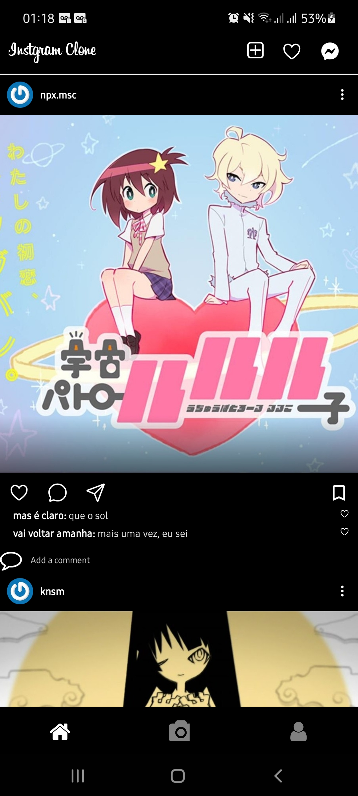

# Instagram Clone

  

I'm trying to clone Instagram to learn a build social network apps flow

This app dont contains all functionalities that original app, I simplified some characteristics

    

<h2>Funcionalitties</h2>
<ul>
  <li>Posts Scroll</li>
  <li>Logout Fuction</li>
</ul>
<h2>Technologies</h2>
<ul>
  <li>React Native</li>
  <li>Typescript</li>
  <li>Axios</li>
  <li>Context API</li>
  <li>OAuth2 Discord</li>
  <li>React Navigation</li>
  <li>Vector Icons</li>
  <li>Visual Studio</li>
</ul>
<h2>How to use</h2>
<ul>
  <li>Install Node and React Native</li>
  <li>Download zip or git clone and</li>
  <li>Use packet manager of your preference to install dependencies</li>
  <li>Run 'npx react-native run-android' on local project</li>
</ul>
<h2>Credits</h2>

All images are illustrative and I used them for static app content only

